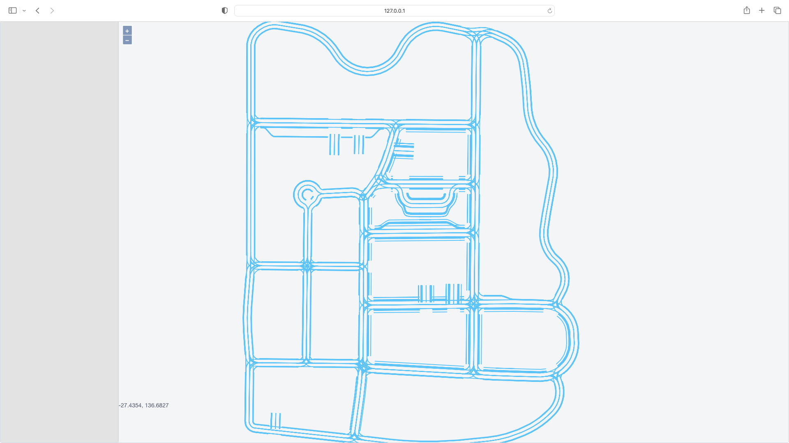

# OpenDRIVE Engine



## Dependence

- [opendrive-parse](https://github.com/minhanghuang/opendrive-cpp)
- [tinyxml2](https://github.com/leethomason/tinyxml2)
- [nanoflann](https://github.com/jlblancoc/nanoflann)
- [http-server](https://github.com/minhanghuang/cyclone)

## Install 

```bash
python3 setup.py
```

## References

[imap](https://github.com/daohu527/imap)
